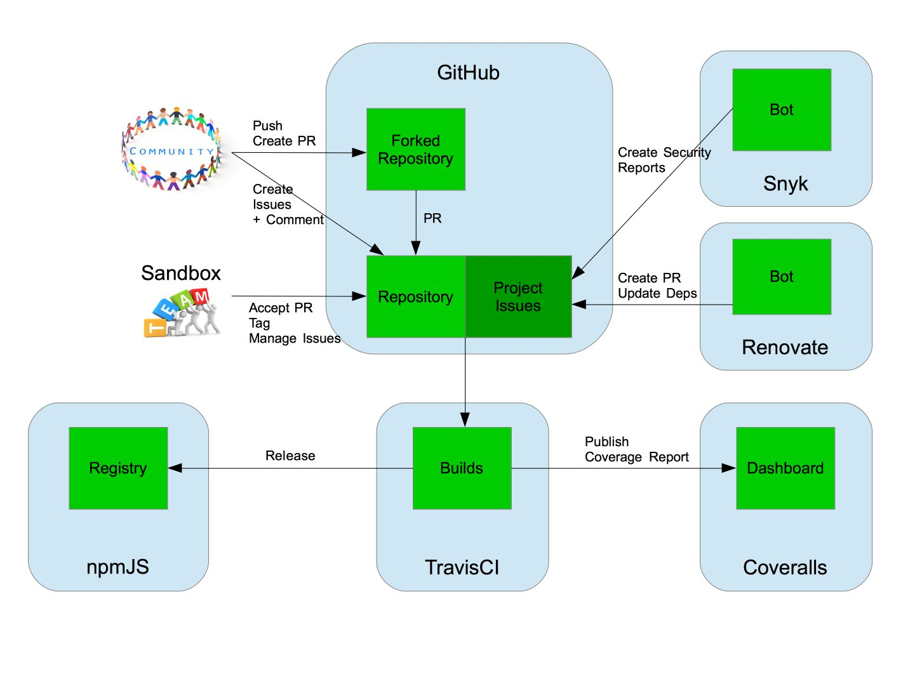

# url-params-appender

[](https://travis-ci.org/github/jvanhent/url-params-appender)
[](https://coveralls.io/github/jvanhent/url-params-appender)
[](https://david-dm.org/jvanhent/url-params-appender)
[](https://david-dm.org/jvanhent/url-params-appender?type=dev)
[](https://snyk.io/test/github/jvanhent/url-params-appender?targetFile=package.json)

A library that builds a URL, adding query parameters, taking priority params into account. 
This is for very usefull when you want to rebuild the current URL, but add/replace the 'page' and 'pageSize'

## Installation

To install with npm:

```
npm i url-params-appender --save
```

## Usage

Usage with node:

```
var buildUrl = require('url-params-appender');

buildUrl('https://go/see', 
    {
        page: 1, 
        bbb: 111,
        ccc: 'val'
    }, 
    {
        page:2,
        pageSize:5
    }
);

// returns https://go/see?page=2&bbb=111&ccc=val&pageSize=5
```

## License

This is licensed under an MIT License. [See details](LICENSE)


## Contribution

